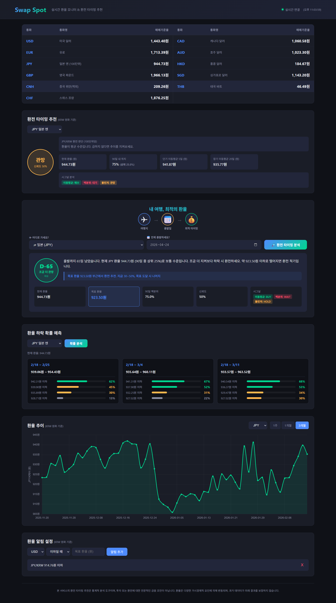

# Swap Spot

> 실시간 환율 모니터 & 환전 타이밍 추천 대시보드

해외여행, 직구, 송금 시 **최적의 환전 시점**을 파악하기 위한 실시간 환율 모니터링 서비스입니다.



---

## ✨ Features

### 실시간 환율 테이블
- 11개 주요 통화(USD, EUR, JPY, GBP, CNH, CHF, CAD, AUD, HKD, SGD, THB) 매매기준율 표시
- WebSocket 기반 실시간 업데이트 (새로고침 불필요)
- 2단 레이아웃으로 한눈에 비교

### 환전 타이밍 추천 (3-Signal)
| Signal | Method | Logic |
|--------|--------|-------|
| 이동평균 | 5일 vs 20일 MA 교차 | 단기 MA < 장기 MA → WAIT |
| 백분위 | 90일 분포 내 현재 위치 | 하위 25% → BUY |
| 볼린저 밴드 | 20일 MA ± 2σ | 하단 터치 → BUY |

3개 시그널 투표 → **BUY** / **HOLD** / **WAIT** 추천 + 신뢰도 제공

### 여행 환전 플래너
- 여행지 + 출발일 입력 → D-day 기반 환전 전략 분석
- 남은 기간에 따른 **긴급도 자동 조정** (여유 → 주의 → 긴급 → 즉시)
- **목표 환율** 제시 (HOLD/WAIT 시 얼마에 환전하면 좋을지)
- 분할 환전 비율 추천

### 환율 하락 확률 예측
- **Monte Carlo 시뮬레이션** (Historical Block Bootstrap, 5,000회)
- 1주 / 2주 / 3주 단위 실제 날짜 범위로 예측
- 변동성 기반 **동적 목표가** 자동 산출 (0.15σ ~ 1.0σ)
- 목표가별 하락 확률을 시각적 바 차트로 표시
- 5분 캐시로 빠른 응답

### 환율 추이 차트
- Chart.js 기반 인터랙티브 차트 (1주 / 1개월 / 3개월)
- 마우스 휠 줌, 드래그 팬 지원
- 환전 시 수령액(TTB) 기준 표시

### 환율 알림
- 목표 환율 도달 시 브라우저 + Telegram 알림
- 조건: 이하 / 이상 / 변동률(%)
- 60분 쿨다운으로 중복 발송 방지

---

## 🛠 Tech Stack

| Layer | Tech | Why |
|-------|------|-----|
| Backend | FastAPI (Python) | Async native, WebSocket 내장 |
| HTTP Client | httpx (async) | 비동기 다중 소스 동시 호출 |
| Scraping | BeautifulSoup4 + lxml | 하나은행 페이지 파싱 |
| Scheduler | APScheduler | 인프로세스 주기적 데이터 수집 |
| Database | SQLite (aiosqlite) | 무설정, 경량 히스토리 저장 |
| ORM | SQLAlchemy 2.0 (async) | 타입 안전한 DB 접근 |
| Forecast | Monte Carlo (stdlib) | Block Bootstrap 확률 예측 |
| Frontend | Vanilla HTML/CSS/JS | 빌드 불필요, 즉시 배포 |
| Chart | Chart.js + Zoom Plugin | 인터랙티브 시계열 차트 |
| Realtime | WebSocket | 브라우저에 즉시 push |

---

## 📡 Data Sources

| Source | Type | Schedule |
|--------|------|----------|
| **한국수출입은행 API** | 공식 환율 (23개 통화) | 매일 11:05 KST |
| **한국은행 ECOS API** | 과거 데이터 보강 | 매일 18:00 KST |
| **하나은행 스크래핑** | 장중 실시간 | 영업시간 중 2분 간격 |

---

## 🚀 Getting Started

### 1. Clone & Install

```bash
git clone https://github.com/hayeong25/Swap-Spot.git
cd Swap-Spot
pip install -e .
```

### 2. API Key 설정

```bash
cp .env.example .env
```

`.env` 파일에 API 키 입력:
```env
KOREAEXIM_API_KEY=your_key_here    # https://www.koreaexim.go.kr/ir/HPHKIR020M01?apino=2
ECOS_API_KEY=your_key_here         # https://ecos.bok.or.kr/api
```

### 3. 히스토리 데이터 시드 (선택)

```bash
python scripts/seed_real_history.py
```
> 수출입은행 API에서 90일간 실제 환율 데이터를 가져와 DB에 저장합니다.

### 4. 서버 실행

```bash
uvicorn app.main:app --reload --host 0.0.0.0 --port 8000
```

`http://localhost:8000` 접속

---

## 📂 Project Structure

```
app/
├── main.py                    # FastAPI 앱 진입점
├── config.py                  # 환경변수 설정 (env, api_timeout 등)
├── models/                    # SQLAlchemy ORM
│   ├── database.py            # async 엔진 + 세션
│   ├── exchange_rate.py       # 환율 테이블
│   └── alert.py               # 알림 설정 테이블 (is_active 인덱스)
├── sources/                   # 데이터 수집
│   ├── koreaexim.py           # 수출입은행 API
│   ├── ecos.py                # 한국은행 ECOS API
│   ├── hanabank.py            # 하나은행 스크래퍼
│   └── aggregator.py          # 다중 소스 통합
├── services/                  # 비즈니스 로직
│   ├── rate_service.py        # 환율 캐시 (asyncio.Lock) + DB 저장
│   ├── timing_engine.py       # 3-Signal 타이밍 + 여행 플래너
│   ├── forecast_engine.py     # Monte Carlo 확률 예측
│   ├── alert_service.py       # 알림 평가 + 쿨다운 + Telegram 재시도
│   └── scheduler.py           # 주기적 데이터 수집
├── api/                       # 엔드포인트
│   ├── routes_rates.py        # 환율 + 타이밍 + 예측 REST API
│   ├── routes_alerts.py       # 알림 CRUD API
│   └── websocket.py           # 실시간 WebSocket
├── schemas/                   # Pydantic 스키마 (알림 조건 검증 포함)
└── utils/                     # 유틸리티

static/                        # 프론트엔드
├── index.html                 # SPA 대시보드
├── css/style.css              # 다크 테마 스타일 (반응형 3단계)
├── js/app.js                  # 메인 로직 (WS 지수 백오프, 디바운스)
└── images/                    # 스크린샷
```

---

## 📌 API Endpoints

| Method | Path | Description |
|--------|------|-------------|
| `GET` | `/api/rates/latest` | 주요 통화 최신 환율 |
| `GET` | `/api/rates/timing/{currency}` | 환전 타이밍 분석 |
| `GET` | `/api/rates/travel-timing/{currency}?travel_date=` | 여행 환전 플래너 |
| `GET` | `/api/rates/forecast/{currency}` | 환율 하락 확률 예측 (Monte Carlo) |
| `GET` | `/api/rates/health/sources` | 데이터 소스 헬스체크 |
| `GET` | `/api/rates/{currency}?days=30` | 환율 히스토리 |
| `GET` | `/api/alerts/` | 알림 목록 |
| `POST` | `/api/alerts/` | 알림 추가 |
| `DELETE` | `/api/alerts/{id}` | 알림 삭제 |
| `WS` | `/ws/rates` | 실시간 환율 스트림 |
| `GET` | `/docs` | Swagger UI |

---

## ⚠️ Disclaimer

본 서비스의 환전 타이밍 추천 및 확률 예측은 **통계적 분석 도구**이며, 투자 또는 환전에 대한 전문적인 금융 조언이 아닙니다. 환율은 다양한 거시경제적 요인에 의해 변동되며, 과거 데이터가 미래 결과를 보장하지 않습니다.
